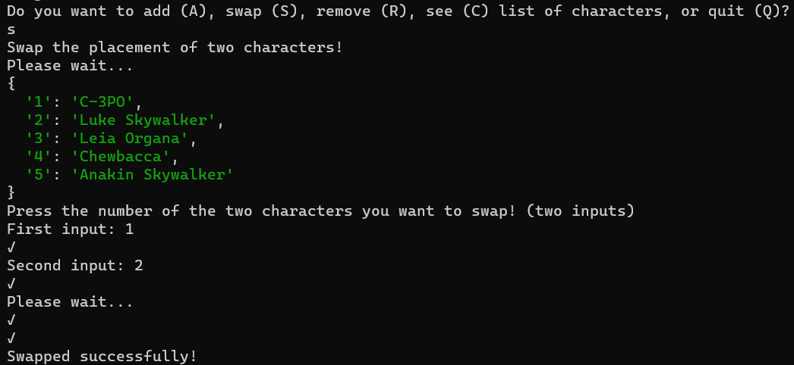
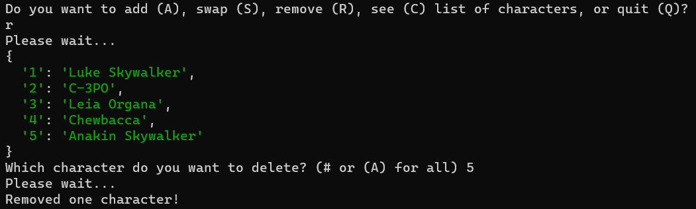
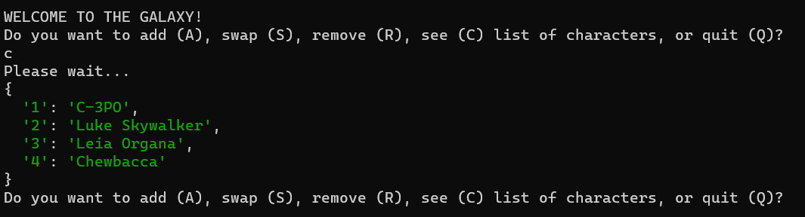

# SWAPI Star Wars Character Ranking App
## Table of contents
- [Description](#Description)
- [Installation and Setup](#installation-and-setup)
- [Project Features](#project-features)
- [Techonolgies Used](#technologies-used)
## Description: 
Entering into the Star Wars Universe you now have the abillity to search for and select any character you want from the SWAPI-api and rank them, all by your liking. You can add, reorder and remove the characters however you want. 
## Installation and Setup
### Installation: 
Make sure you have the following software installed:

- [Node.js](https://nodejs.org/) (version 18 or higher)
- [Git](https://git-scm.com/)

In your console, clone the repository by writing:
```bash
git clone https://github.com/BenyoMano/node-starwars-api-MongoDB.git
```
When finished, start the app by:
````bash
cd node-starwars-api-MongoDB && node app.js
````
## Project Features
### List of Features: 
- Add any, one or several characters to your ranked list.
- Swap them to rearrange the order.
- Remove one or all characters.
- Watch and enjoy your ranked list of characters.
### Examples:




## Technologies Used
**Server:** Node.js v20.2.5

**Database:** MongoDB 